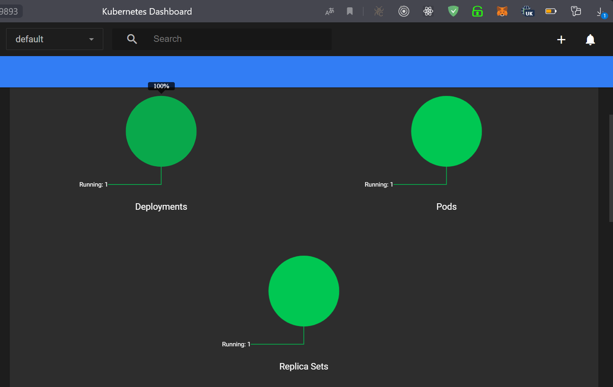
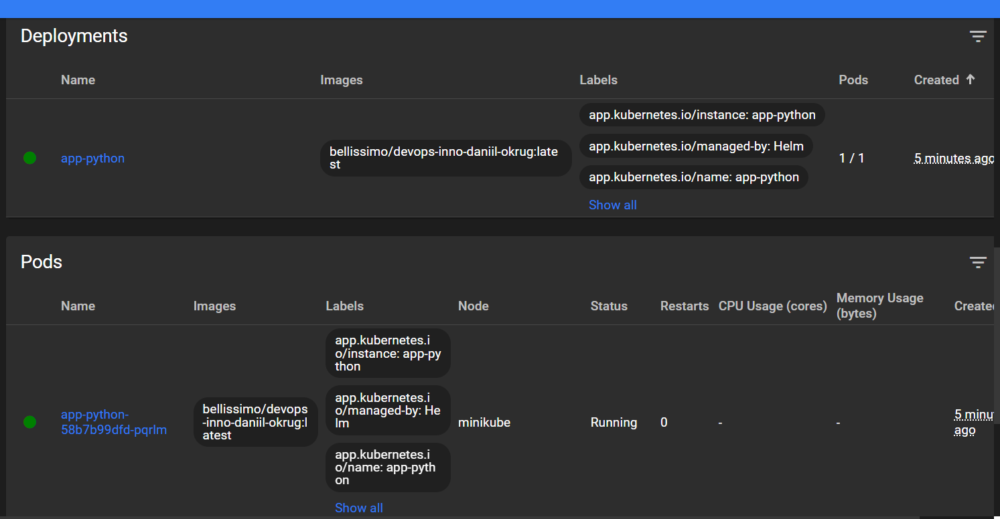

# HELM

## Workloads




## Check app access
```sh
PS C:\Users\Angel\OneDrive\Рабочий стол\repositories\dev-ops-inno\k8s> minikube service app-python  
|-----------|------------|-------------|---------------------------|
| NAMESPACE |    NAME    | TARGET PORT |            URL            |
|-----------|------------|-------------|---------------------------|
| default   | app-python | http/5000   | http://192.168.49.2:31421 |
|-----------|------------|-------------|---------------------------|
🏃  Starting tunnel for service app-python.
|-----------|------------|-------------|------------------------|
| NAMESPACE |    NAME    | TARGET PORT |          URL           |
|-----------|------------|-------------|------------------------|
| default   | app-python |             | http://127.0.0.1:50376 |
|-----------|------------|-------------|------------------------|
🎉  Opening service default/app-python in default browser...
❗  Because you are using a Docker driver on windows, the terminal needs to be open to run it.
```

```sh
PS C:\Users\Angel\OneDrive\Рабочий стол\repositories\dev-ops-inno\k8s> kubectl get pods,svc
NAME                              READY   STATUS    RESTARTS   AGE
pod/app-python-58b7b99dfd-pqrlm   1/1     Running   0          7m54s

NAME                 TYPE           CLUSTER-IP      EXTERNAL-IP   PORT(S)          AGE
service/app-python   LoadBalancer   10.97.218.159   <pending>     5000:31421/TCP   7m54s
service/kubernetes   ClusterIP      10.96.0.1       <none>        443/TCP          6d12h
```