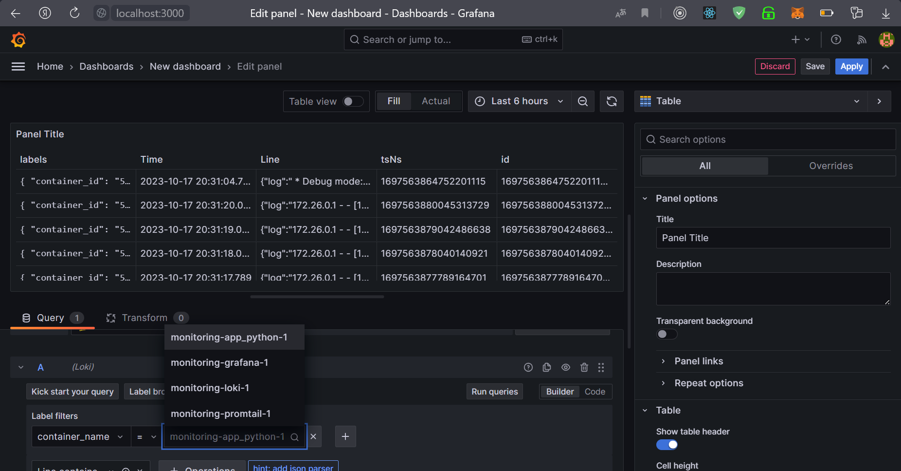

# Logging

## Grafana
The Grafana configuration in your Docker Compose file is set up to run Grafana with specific settings and provisions a Loki data source.

- environment: These environment variables configure Grafana:
    - GF_PATHS_PROVISIONING: Specifies the directory where provisioning files are stored. Grafana uses this directory to load configuration files.
    - GF_AUTH_ANONYMOUS_ENABLED: Enables anonymous authentication for Grafana.
    - GF_AUTH_ANONYMOUS_ORG_ROLE: Sets the role for anonymous users (Admin in this case).

- entrypoint: This section specifies the entry point command when the Grafana container starts. It does the following:
    - Creates the directory /etc/grafana/provisioning/datasources.
    - Generates a configuration file ds.yaml for the Loki data source inside that directory. This configuration sets up Loki as a data source with specific settings.
    - Finally, it runs /run.sh.

- image: Specifies the Grafana Docker image to use (grafana/grafana:latest).

- ports: Maps port 3000 of the host to port 3000 of the Grafana container, allowing you to access Grafana's web interface.

- networks: Places the Grafana container in the loki network, ensuring it can communicate with other services in the same network, including Loki.

- logging: This section appears to be using a logger configuration that you defined elsewhere in your Docker Compose file (the *logger alias). It's used to specify the logging driver and options for Grafana's logs.

## Promtail
Promtail is a log collector used for scraping log entries from various sources and forwarding them to Loki for storage and analysis.

- image: Specifies the Docker image to use for Promtail (grafana/promtail:2.9.0 in this case). This image is provided by Grafana Labs and is specifically designed for scraping and forwarding logs to Loki.

- volumes: Mounts two volumes into the Promtail container:
    - /var/lib/docker/containers:/var/lib/docker/containers: This volume allows Promtail to access log files from Docker containers. It scrapes logs directly from Docker containers to forward them to Loki.
    - ./promtail.yaml:/etc/promtail/config.yml: This volume mounts your local promtail.yaml configuration file into the container at /etc/promtail/config.yml. This configuration file specifies how Promtail should scrape logs and where to send them.

- command: Sets the command to run when the Promtail container starts. It specifies the configuration file for Promtail as -config.file=/etc/promtail/config.yml, which is the path to the mounted promtail.yaml file.

- networks: Places the Promtail container in the loki network. This network allows Promtail to communicate with other services in the same network, including Loki, to forward the scraped logs.

- logging: Similar to the Grafana service, it appears that you're using a logger configuration defined elsewhere in your Docker Compose file (the *logger alias). This configuration specifies how Promtail logs should be handled.

## Loki
Loki is a horizontally scalable, highly available log aggregation system that is part of the Grafana observability stack. It is designed to collect, store, and query log data efficiently. 

- image: Specifies the Docker image to use for Loki (grafana/loki:2.9.2 in this case). This image is provided by Grafana Labs and contains Loki, the log aggregation system.

- ports: Maps port 3100 of the host to port 3100 of the Loki container. This allows you to access the Loki HTTP API and query log data from outside the container.

- command: Sets the command to run when the Loki container starts. It specifies the configuration file for Loki as -config.file=/etc/loki/local-config.yaml. This is where you can define various settings for Loki, including storage configurations, log labels, and more. The actual configuration file is expected to be present within the container at the specified path.

- networks: Places the Loki container in the loki network. This network allows Loki to communicate with other services in the same network, such as Promtail and Grafana, for log collection and querying.

- logging: It appears that you're using a logger configuration defined elsewhere in your Docker Compose file (the *logger alias). This configuration specifies how Loki logs should be handled.

## Results
